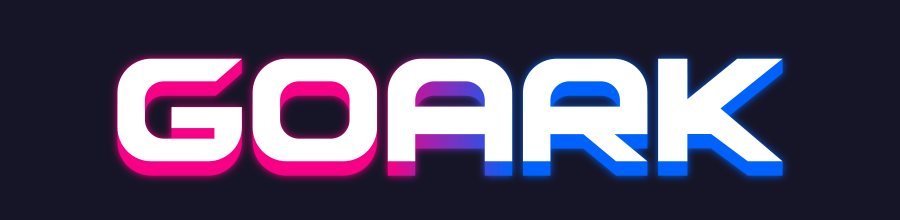
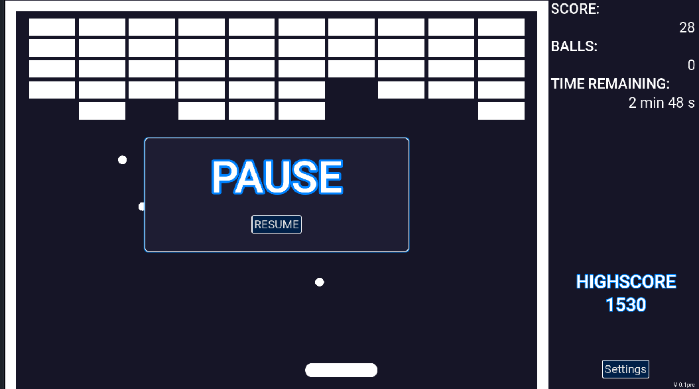

<h1 align = "center">
  
</h1>

  

Welcome to GOARK This is a game I created to learn Godot. I'm excited to share
it with you and would love to hear your feedback for improvements.

## Description

GoArk is an Arkanoid-inspired game with a twist: you start each level with 5
balls and can control the launch of each ball. The goal is to strategically
use these balls to maximize your score and break through the toughest levels.
If no ball is in play, you lose.

## Features

- **Controls:**
  - **Move Paddle:** Use your finger or mouse.
  - **Launch Balls:** Tap the screen while your finger is on the paddle or
    press the space bar.

- **Gameplay:**
  - For each level, you get 5 balls to play. Control the launch of each ball
    strategically to maximize your score.

## Open Issues

I'm working on the following features for learning purposes:
- Language Support
- Different Levels
- Start Screen

## Feedback

Your comments and suggestions are greatly appreciated. Feel free to open issues
or pull requests to help improve the game.

## License

This project is licensed under the MIT License. See the LICENSE file for details.

## Audio Files License

All sounds where created using ChipTone are FREE to use for any purpose,
commercial or otherwise, under the CC0 licence. See the
actors/audioplayer/_LICENSE_sounds.wav.txt file for details.
The music was created by Ben burnes and is licensed under the CC0 licence. See
the actors/audioplayer/_LICENSE_background_music.ogg.txt file for details.

## Links

- Play [GOARK](https://mweb.itch.io/goark) on itch.io

